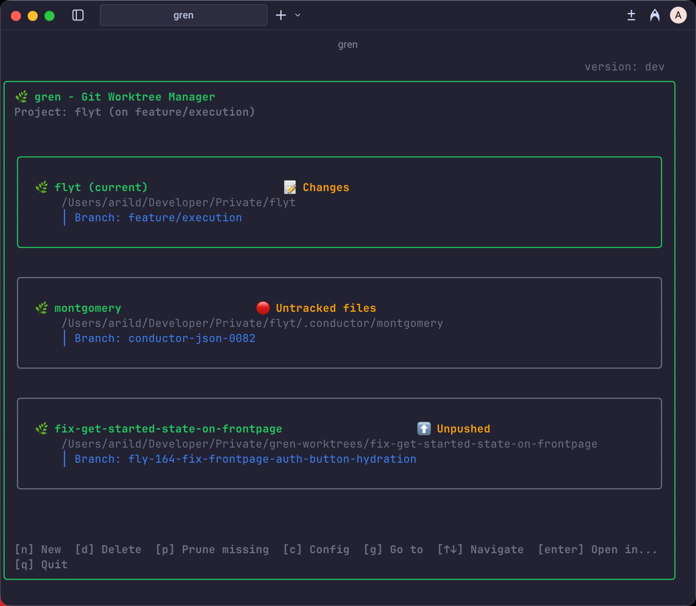

# 🌿 gren

A beautiful terminal UI for managing Git worktrees efficiently.

Gren makes it easy to create, manage, and switch between Git worktrees with an intuitive interface. Perfect for developers who work with multiple branches simultaneously or need to quickly test different features without stashing changes.



## About the Name

**gren** (pronounced "grain" /ɡreːn/) is the Norwegian word for "branch" 🌿

Just as git uses branches to organize code, gren helps you manage the physical directories (worktrees) where those branches live.

## Features

- ✨ Beautiful, intuitive TUI interface built with Bubble Tea
- 🚀 Fast worktree creation and management
- 🔧 Configurable post-create hooks and automation
- 🔗 Smart file symlinking (env files, configs, etc.)
- 🎯 Project-specific setup workflows
- 🎨 Clean, modern terminal design with responsive layout
- ⌨️ Keyboard-driven navigation with built-in help overlay
- 🔍 Search and filter branches
- 💤 Stale worktree detection (merged branches, closed PRs)
- 🔗 GitHub CLI integration for PR status and badges
- 🧹 Bulk cleanup of stale and missing worktrees

## Installation

### Homebrew (macOS - Recommended)

```bash
brew tap langtind/tap
brew install gren
```

Or install directly:
```bash
brew install langtind/tap/gren
```

### Download Pre-built Binaries

Download the latest release for your platform from [GitHub Releases](https://github.com/langtind/gren/releases).

### Install with Go

```bash
go install github.com/langtind/gren@latest
```

*Note: `go install` builds from source and may show "dev" as version. For proper version numbers, use Homebrew or download pre-built binaries.*

### Build from Source

```bash
git clone https://github.com/langtind/gren.git
cd gren
go build -o gren .
```

## Shell Integration (Required for Navigation)

To enable the `g` key binding and CLI navigation commands, add this to your shell config:

**Zsh** (~/.zshrc):
```bash
eval "$(gren shell-init zsh)"
```

**Bash** (~/.bashrc):
```bash
eval "$(gren shell-init bash)"
```

**Fish** (~/.config/fish/config.fish):
```fish
gren shell-init fish | source
```

This enables:
- `g` key in TUI to navigate directly to a worktree folder
- `gcd <name>` CLI alias for quick navigation
- `gren navigate <name>` command

## Quick Start

1. Navigate to any Git repository
2. Run `gren` to start the interactive interface
3. Use keyboard shortcuts to manage worktrees:
   - `↑↓` or `jk` Navigate between worktrees
   - `Enter` Open in... menu (IDE, terminal, Finder)
   - `g` Navigate to worktree folder (requires shell integration)
   - `n` Create new worktree
   - `d` Delete worktree
   - `t` Tools menu (merge, for-each, step commit, cleanup, refresh)
   - `c` Configure gren
   - `i` Initialize gren configuration
   - `?` Show help overlay
   - `q` Quit

## Usage

```bash
gren          # Launch interactive TUI
gren --help   # Show help and keyboard shortcuts
gren --version # Show version information
```

## Status Indicators

The TUI displays various indicators to show worktree status:

| Symbol | Description |
|--------|-------------|
| `●` | Current worktree (you are here) |
| `[main]` | Main worktree (original repo) |
| `+N` | Staged files (ready to commit) |
| `~N` | Modified files |
| `?N` | Untracked files |
| `↑N` | Unpushed commits |
| `✓` | Clean (no changes) |
| `💤` | Stale branch (merged/closed PR) |
| `#N` | Pull request number |

## CLI Examples

### Initialize a project

```bash
cd my-project
gren init
```

This creates `.gren/config.json` and `.gren/post-create.sh` in your repository.

### Configure post-create hook

Edit `.gren/post-create.sh` to run setup commands when creating new worktrees:

```bash
#!/bin/bash
WORKTREE_PATH="$1"
cd "$WORKTREE_PATH"

# Install dependencies
bun install

# Symlink environment files (stays in sync with main repo)
ln -sf "../.env" .env.local
```

### Create a worktree

```bash
# Create new branch "my-feature" from current branch
gren create -n my-feature

# Create new branch "bugfix" from develop
gren create -n bugfix -b develop

# Check out existing branch "feature-123" into a worktree
gren create -n feature-123 -existing
```

The post-create hook runs automatically after worktree creation.

### Clean up stale worktrees

```bash
# Preview what would be deleted
gren cleanup --dry-run

# Delete all stale worktrees (with confirmation)
gren cleanup

# Delete without confirmation
gren cleanup -f

# Force delete (ignore uncommitted changes)
gren cleanup --force-delete
```

Stale worktrees are branches that have been merged, have closed PRs, or no longer exist on remote.

## Shell Completions

Enable tab completion for gren commands:

**Bash** (~/.bashrc):
```bash
source <(gren completion bash)
```

**Zsh** (~/.zshrc):
```bash
source <(gren completion zsh)
```

**Fish** (~/.config/fish/config.fish):
```fish
gren completion fish | source
```

Completions include all commands, flags, and dynamic completion for worktree names and branches.

## Configuration

Gren uses a two-level configuration system:

### User Configuration (Global)

Global settings apply across all projects. Location:
- **macOS**: `~/Library/Application Support/gren/config.toml`
- **Linux**: `~/.config/gren/config.toml` (or `$XDG_CONFIG_HOME/gren/config.toml`)
- **Windows**: `%APPDATA%\gren\config.toml`

Example user config:
```toml
[defaults]
worktree-dir = "../{{ repo }}-worktrees"
remove-after-merge = true
squash-on-merge = false
rebase-on-merge = true

[commit-generation]
command = "llm"
args = ["-m", "claude-sonnet"]
template = "Write a commit message for:\n\n{{ diff }}"

[hooks]
post-create = "npm install"
post-switch = "npm run dev"

[[named-hooks.post-create]]
name = "install-deps"
command = "npm install"

[[named-hooks.post-create]]
name = "setup-env"
command = "cp .env.example .env"
branches = ["feature/*"]
```

### Project Configuration

Project-specific settings in `.gren/config.toml` override user defaults:

```toml
worktree-dir = "../my-project-worktrees"

[commit-generation]
command = "llm"
args = ["-m", "gpt-4"]

[hooks]
post-create = "bun install && bun run setup"
pre-merge = "bun test"
post-merge = "bun run deploy"

[[named-hooks.post-create]]
name = "project-setup"
command = "./scripts/setup.sh"
```

## Hook System

Gren supports hooks at various lifecycle points:

| Hook | When it runs |
|------|--------------|
| `post-create` | After creating a new worktree |
| `pre-remove` | Before deleting a worktree |
| `pre-merge` | Before merging a worktree |
| `post-merge` | After successfully merging |
| `post-switch` | After switching to a worktree |
| `post-start` | After starting an external command with `-x` |

### Simple Hooks

Define a single command per hook:
```toml
[hooks]
post-create = "npm install"
pre-merge = "npm test"
```

### Named Hooks

Define multiple hooks with names for better organization:
```toml
[[named-hooks.post-create]]
name = "install"
command = "npm install"

[[named-hooks.post-create]]
name = "setup-env"
command = "ln -sf ../.env .env"
branches = ["feature/*"]  # Only run for feature branches
disabled = false          # Can be temporarily disabled
```

### Hook JSON Context

Hooks receive rich context via the `GREN_CONTEXT` environment variable (JSON) and stdin:

```json
{
  "hook_type": "post-create",
  "branch": "feature/auth",
  "worktree": "/path/to/worktree",
  "worktree_name": "auth",
  "repo": "my-project",
  "repo_root": "/path/to/repo",
  "commit": "abc123def456",
  "short_commit": "abc123d",
  "default_branch": "main",
  "target_branch": "main",
  "base_branch": "develop",
  "execute_cmd": "npm run dev"
}
```

Example hook script using context:
```bash
#!/bin/bash
CONTEXT=$(cat)
BRANCH=$(echo "$CONTEXT" | jq -r '.branch')
WORKTREE=$(echo "$CONTEXT" | jq -r '.worktree')

echo "Setting up $BRANCH in $WORKTREE"
cd "$WORKTREE"
npm install
```

### Hook Approval (Security)

For security, gren requires explicit approval for hook commands. When a new hook is detected:

1. You'll be prompted to approve the command
2. Approved commands are stored in your user config directory
3. Use `gren config approvals` to view approved commands
4. Use `gren config approvals --revoke` to revoke all approvals

This prevents malicious config files from executing arbitrary commands.

## LLM Commit Messages

Generate commit messages using an LLM (like `llm` CLI or similar tools):

### Configuration

```toml
[commit-generation]
command = "llm"
args = ["-m", "claude-sonnet"]
template = """
Write a concise git commit message following conventional commits format.
Focus on the "why" rather than the "what".

Changes:
{{ diff }}
"""
```

### Usage

```bash
# Generate commit message for staged changes
gren step commit

# Or use the TUI step workflow
```

### Template Variables

- `{{ diff }}` - The git diff output
- `{{ branch }}` - Current branch name
- `{{ repo }}` - Repository name

The LLM output is automatically cleaned and validated against conventional commit format.

## GitLab Support

Gren supports both GitHub and GitLab for CI/CD status and merge request information:

- **GitHub**: Uses `gh` CLI for PR status and CI checks
- **GitLab**: Uses `glab` CLI for MR status and pipeline info

The provider is auto-detected from your remote URL. Status indicators work the same for both:

| Status | GitHub | GitLab |
|--------|--------|--------|
| ✅ Success | Checks passed | Pipeline succeeded |
| ❌ Failed | Checks failed | Pipeline failed |
| 🔄 Pending | In progress | Running |
| #N | PR number | MR number |

## CLI Commands

### Core Commands

```bash
gren                          # Launch TUI
gren create -n <name>         # Create worktree
gren delete <name>            # Delete worktree
gren switch <name>            # Switch to worktree
gren list                     # List all worktrees
gren merge <name>             # Merge worktree to target branch
```

### Workflow Commands

```bash
gren for-each <command>       # Run command in all worktrees
gren step commit              # Interactive commit with LLM message
gren step squash              # Squash commits interactively
gren cleanup                  # Clean up stale worktrees
```

### Configuration Commands

```bash
gren init                     # Initialize gren in current repo
gren config                   # Open configuration
gren config approvals         # View approved hook commands
gren help hooks               # Detailed hook documentation
gren completion <shell>       # Output shell completion script
gren shell-init <shell>       # Output shell integration script
```

### Utility Commands

```bash
gren compare <worktree>       # Compare changes between worktrees
gren marker set <name>        # Set a named marker at current commit
gren marker get <name>        # Get marker commit
gren marker clear <name>      # Clear a marker
gren marker list              # List all markers
```

## Development

This project uses:
- [Bubble Tea](https://github.com/charmbracelet/bubbletea) for TUI framework
- [Lipgloss](https://github.com/charmbracelet/lipgloss) for styling
- [Bubbles](https://github.com/charmbracelet/bubbles) for UI components

### Project Structure

```
gren/
├── internal/
│   ├── cli/           # CLI commands and help
│   ├── config/        # Configuration management
│   ├── core/          # Worktree operations, hooks, LLM
│   ├── git/           # Git operations and CI providers
│   ├── logging/       # Logging utilities
│   └── ui/            # TUI components and views
└── main.go            # Entry point
```

## License

MIT